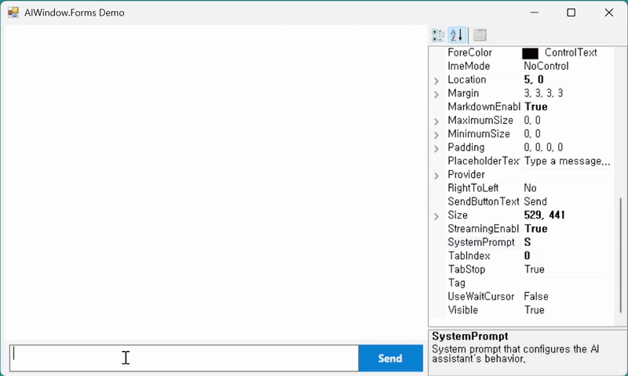

# AI창 — 기업용 AI 도입의 가장 빠른 길

> 복잡한 개발 과정 없이, 귀사의 업무용 프로그램에 보안이 검증된 AI 채팅 기능을 단 5분 만에 추가하세요.

*모든 규모의 비즈니스를 위한 Enterprise AI Component*

---

## 업무용 프로그램에 *AI 채팅*을 5분 만에.

복잡한 개발 과정 없이, 검증된 AI 채팅 컴포넌트를 기존 사내 데스크톱 애플리케이션에 그대로 추가합니다. WinForms부터 시작해 윈도우 데스크톱 환경 전반으로 확장됩니다.

- **WinForms** · 검증 단계
- **WPF · Delphi · MFC · VB6** · 로드맵
- **OpenAI · Azure · On-Prem LLM** 호환

---

## Live Demo — 실제 동작 영상

기존 WinForms 애플리케이션에 AI창 컴포넌트를 드래그&드롭으로 배치하고, AI 채팅 기능을 활성화하는 과정입니다.

`// AIWindow.Forms · drag-and-drop integration`

[MP4 영상으로 보기 ↗](docs/demo.mp4)

---

## The Problem — 기업 AI 도입을 가로막는 현실적 장벽

AI는 도입하고 싶지만 보안 검토, 레거시 호환, 개발 비용 때문에 시작조차 어려운 기업들이 마주한 다섯 가지 벽.

### 01 / Supply Chain · 외부 공급망 리스크
AI 라이브러리 하나를 도입하면 수십 개의 부속 의존성이 함께 들어옵니다. 각각이 별도의 보안 검증 대상입니다.

### 02 / Legacy · 노후화된 내부 시스템
오래된 개발 환경에는 최신 AI SDK를 적용하기 어렵습니다.

### 03 / Cost · 막대한 개발 비용
채팅 UI를 직접 구현하려면 화면 설계부터 스트리밍 처리까지 수개월이 소요됩니다.

### 04 / Security · 까다로운 보안 심사
출처가 불분명한 외부 패키지는 기업 보안 정책 통과가 어려워 도입 단계에서 좌절됩니다.

### 05 / Compliance · 법적 규제 준수
금융·의료·공공처럼 규제가 엄격한 산업에서는 감사 로그·데이터 보호 기능이 필수입니다.

---

## Why AI창 — 외부 위험 요소 제로, 안전한 AI 도입

AI창은 외부 라이브러리에 의존하지 않습니다. 각 환경의 기본 프레임워크와 검증된 운영체제 기능만으로 구성되어, 기업 정보보안 부서의 승인을 빠르게 받을 수 있습니다.

| 항목 | 기존 AI 도입 방식 | AI창 |
| --- | --- | --- |
| 데이터 전송 | 외부 보안 검증이 필요한 부가 컴포넌트 | **운영체제 기본 기능** 사용 |
| 데이터 처리 | 외부에서 개발된 복잡한 파이프라인 | **자체 구현**, 보안 무결성 |
| 화면 표시 | 여러 외부 렌더링 라이브러리 조합 | **자체 렌더러**, 오류 최소화 |
| 관리 대상 | 수십 개의 외부 패키지 | **외부 코드 없음** |
| 보안 취약점 | 외부 패키지의 잠재적 결함 | 운영체제 검증 수준으로 **한정** |

---

## Core Values — 비즈니스 성과를 높이는 지능형 채팅 솔루션

### → Connectivity · 안정적인 AI 연결
OpenAI, Azure OpenAI, Anthropic을 비롯한 글로벌 LLM 및 OpenAI 호환 자체 호스팅 엔진과 즉시 연동. 끊김 없는 실시간 스트리밍, 자동 복구.

### → Experience · 사용자 중심 인터페이스
직관적인 대화 UI, 마크다운·코드 블록·테이블의 고품질 렌더링, 기업 브랜드에 맞는 자유로운 디자인 커스터마이징.

### → Deployment · 신속한 도입과 운영
Visual Studio 디자이너에서 드래그&드롭, 옵션 설정만으로 즉시 동작. 감사 로그·역할 기반 권한·관리 콘솔 기본 제공.

---

## Deployment — 3가지 도입 방식, 고객 환경에 맞춰 선택

Cloud부터 완전 폐쇄망까지, 데이터 민감도와 인프라 환경에 맞춰 선택할 수 있습니다. 모든 티어는 동일한 AI창 API와 관리 콘솔을 공유합니다.

### Tier 1 — Cloud · 표준 배포
OpenAI, Anthropic 등 공인 LLM API를 직접 연동. 가장 빠른 도입과 최신 모델 활용이 가능합니다.

**적합 고객** · 스타트업 · 중견기업 · 일반 SaaS

### Tier 2 — Hybrid · 선택적 격리
민감 데이터는 사내에서 처리하고 일반 트래픽은 Cloud로. 비용과 보안의 균형을 최적화합니다.

**적합 고객** · 성장기 기업 · 규제 산업 진입

### Tier 3 — On-Prem · 완전 폐쇄망
고객 인프라 내 LLM 실행. 외부 통신 없음. 망분리·국가기밀 환경 대응. Ollama·vLLM·LM Studio 등 호환.

**적합 고객** · 금융 · 공공 · 의료 · 방산

---

## Our Philosophy — 새 기술 도입이 두려운 이유, 우리는 압니다

> 기업이 새 기술 앞에서 망설이는 것은 게으름이 아닙니다. 한 번 잘못 도입한 기술이 5년, 10년 동안 운영팀을 괴롭힌다는 것을 알기 때문입니다. 보안 부서는 검증되지 않은 의존성에 책임을 질 수 없고, IT 부서장은 매년 새로 등장하는 라이브러리에 다시 검증 비용을 들이고 싶지 않습니다.
>
> *— AI창 설계 원칙*

AI창이 외부 의존성을 최소화하고 각 환경의 기본 프레임워크 위에서만 동작하도록 설계된 것은 바로 그 때문입니다. UI 스택이 확장되어도, 기업이 검증해야 할 신뢰 경계는 변하지 않습니다. 한 번의 보안 심사로 다음 도입까지 이어집니다.

### Roadmap — 모든 윈도우 데스크톱 환경으로

| 패키지 | 대상 | 상태 |
| --- | --- | --- |
| `AIWindow.Forms` | 기존 데스크톱 업무 프로그램 | ◐ In Validation |
| `AIWindow.Wpf` | 대규모 관리 시스템 | ○ Planned |
| `AIWindow.Delphi` | 금융·제조 핵심 업무 시스템 | ○ Planned |
| `AIWindow.Mfc` | 레거시 C++ 기업 애플리케이션 | ○ Planned |
| `AIWindow.Vb6` | 장기 운영 중인 사내 업무 도구 | ○ Planned |

**한 번 AI창을 도입한 조직은, 다음 UI 스택으로 확장할 때 신뢰 모델을 처음부터 다시 검증할 필요가 없습니다.** 동일한 의존성 프로파일, 동일한 기본 프레임워크 원칙, 동일한 보안 경계. 새로운 기술 도입의 부담을 최소화하는 것이 AI창이 멀티 스택을 지원하는 방식입니다.

---

## Use Cases — 업종별 AI 업무 환경 혁신

### → Finance · 금융 — 지식 어시스턴트
복잡한 내부 규정과 상품 정보를 AI가 즉시 답변. 민감 데이터 유출 없는 안전한 환경에서 업무 효율 극대화.

### → Manufacturing · 제조 — 설비 가이드
두꺼운 매뉴얼 대신 AI에게 직접 묻고 답을 얻는 현장. 기존 시스템을 그대로 활용해 추가 비용 없이 도입.

### → Healthcare · 의료 — 의사결정 지원
방대한 임상 가이드라인을 AI가 분석. 자동 기록 저장으로 의료법 등 컴플라이언스 기준을 충족.

### → Public · 공공 — 민원 업무 자동화
공무원 업무용 프로그램에서 AI가 민원 답변 초안을 작성. 폐쇄망 환경에서도 안정 구동.

---

## Get Started — 사전 도입 문의를 받고 있습니다

AI창의 사전 도입을 검토하시는 기업을 위한 컨설팅 프로그램입니다. 기술 검토, 환경 분석, 라이선스 설계까지 함께 논의합니다.

[**사전 도입 신청하기 →**](https://docs.google.com/forms/d/e/1FAIpQLScFMvEBJ8hxRjSu5pC--0f6dCo4Oicll94ncFna0zboHV2Bog/viewform)

또는 이메일로 직접 문의 · <contact@cloudbro.ai>

---

**AI창.**
모든 규모의 비즈니스를 위한 Enterprise AI Component
aichang.dev · © 2026 · Preview Release

AIWindow.Forms · WPF · Delphi · MFC · VB6 *(Roadmap)*
